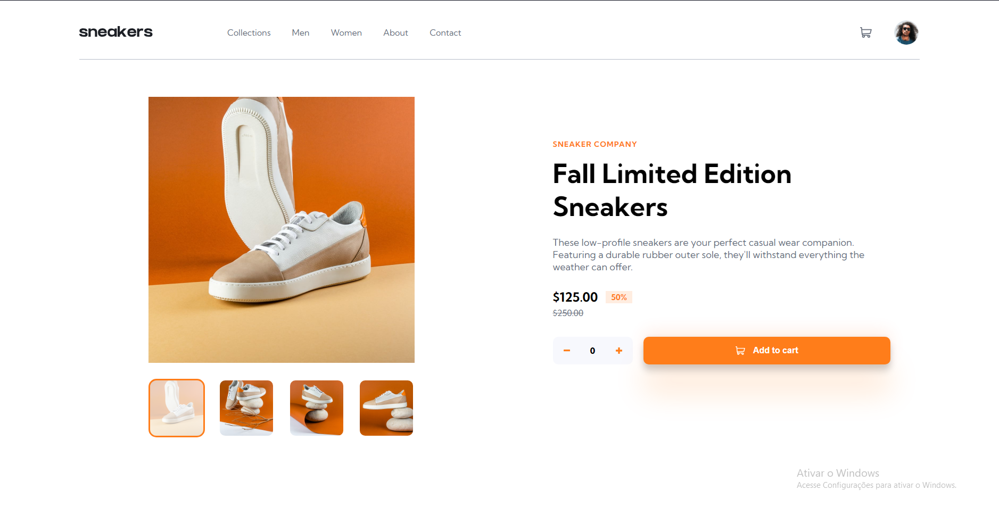

# Frontend Mentor - E-commerce product page solution

This is a solution to the [E-commerce product page challenge on Frontend Mentor](https://www.frontendmentor.io/challenges/ecommerce-product-page-UPsZ9MJp6). Frontend Mentor challenges help you improve your coding skills by building realistic projects.

## Table of contents

- [Overview](#overview)
  - [The challenge](#the-challenge)
  - [Screenshot](#screenshot)
  - [Links](#links)
- [My process](#my-process)
  - [Built with](#built-with)
  - [What I learned](#what-i-learned)
  - [Continued development](#continued-development)

## Overview

### The challenge

Users should be able to:

- View the optimal layout for the site depending on their device's screen size
- See hover states for all interactive elements on the page
- Open a lightbox gallery by clicking on the large product image
- Switch the large product image by clicking on the small thumbnail images
- Add items to the cart
- View the cart and remove items from it

### Screenshot

### Links

- Solution URL: [See website](https://your-solution-url.com)

## My process

### Built with

- Semantic HTML5 markup
- CSS
- JavaScript

### What I learned

Starting the project, i felt confortable in doing the HTML and CSS. But when JS has arrived, it was extremely difficult to manage the classes and divs for the JS.

No doubt, the lightbox was the most difficult thing in my process because i had never done it before.
- I learned how to make a cart function
- How to make a lightbox
- I did a good responsive in my opinion

### Continued development

- I need to learn how to make a lightbox with a slider, it was very difficult to me in a point that i couldn't make it.